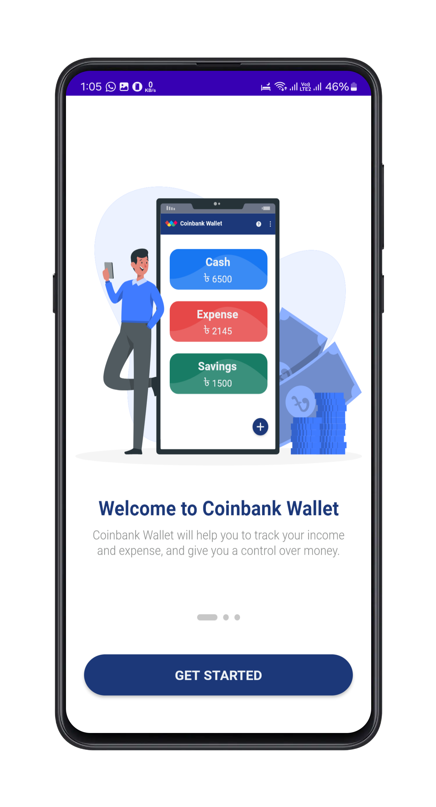
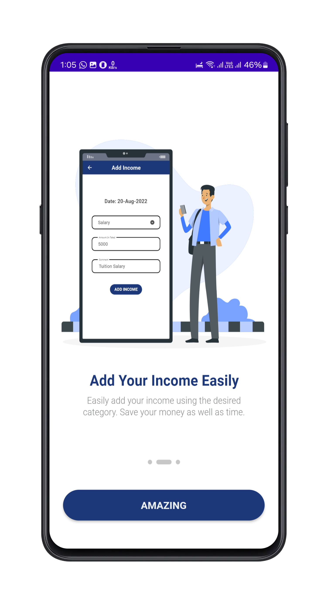
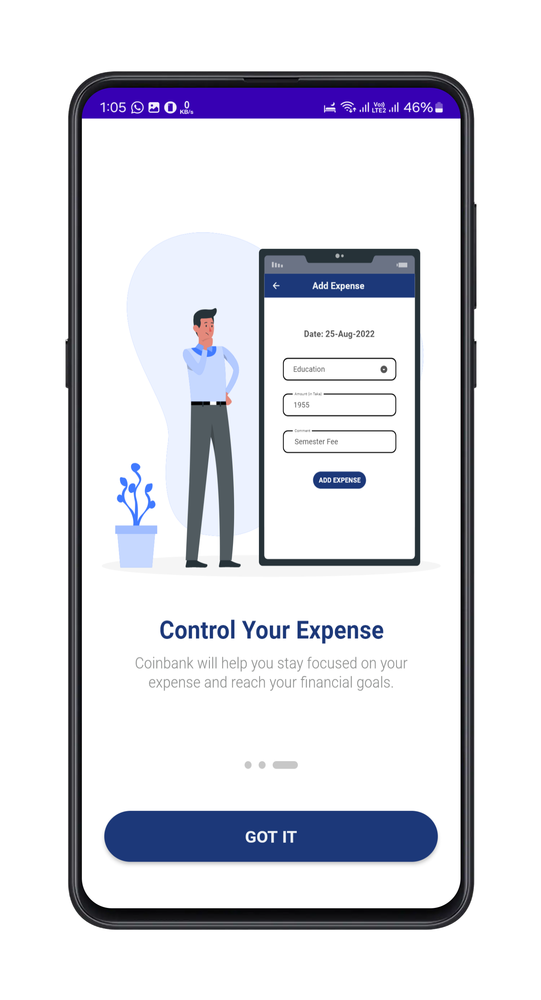
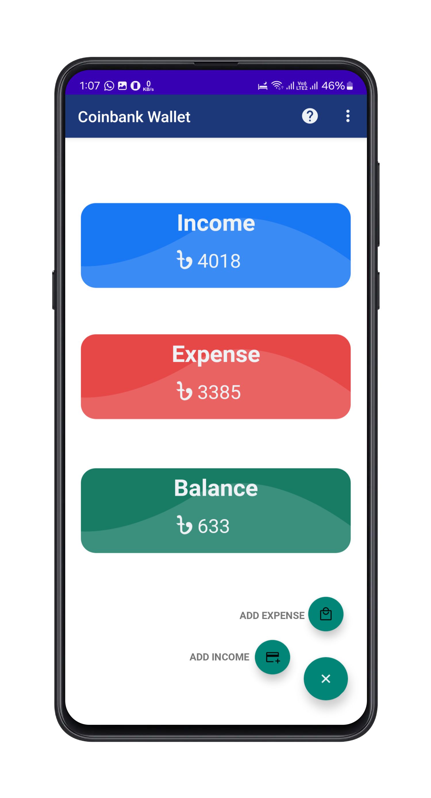
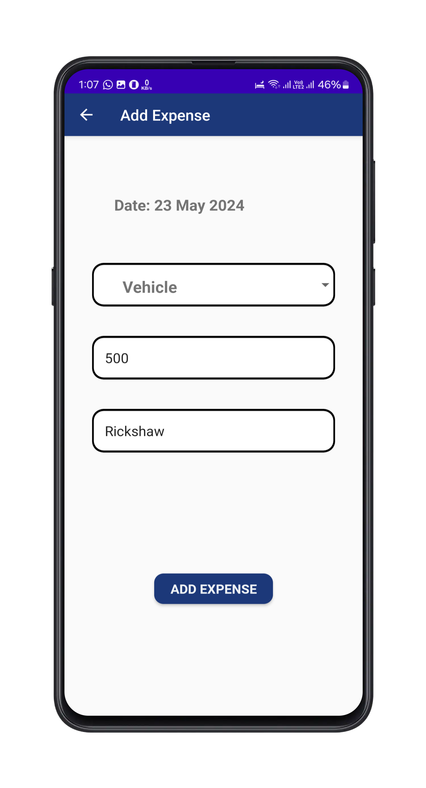
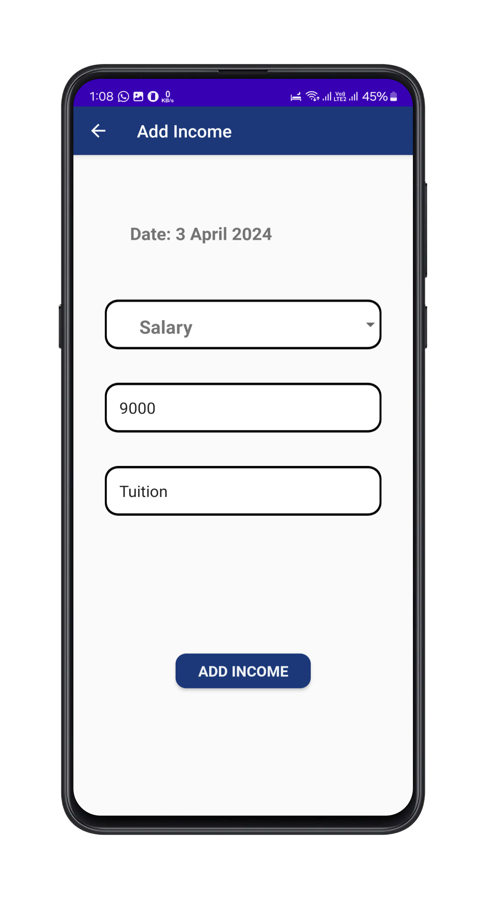

<h1 align="center">CoinBank Wallet App</h1>
<p align="center">
  An Android application project for managing your daily income and expenses.
</p>

<!-- TABLE OF CONTENTS -->
<!-- <details open="open">
  <summary>Table of Contents</summary>
  <ol>
    <li>
      <a href="#about-the-project">About The Project</a>
      <ul>
        <li><a href="#built-with">Built With</a></li>
      </ul>
    </li>
    <li>
      <a href="#getting-started">Getting Started</a>
      <ul>
        <li><a href="#prerequisites">Prerequisites</a></li>
        <li><a href="#installation">Installation</a></li>
      </ul>
    </li>
    <li><a href="#usage">Usage</a></li>
    <li><a href="#roadmap">Roadmap</a></li>
    <li><a href="#contributing">Contributing</a></li>
    <li><a href="#license">License</a></li>
    <li><a href="#contact">Contact</a></li>
    <li><a href="#acknowledgements">Acknowledgements</a></li>
  </ol>
</details> -->

### Scan the QR code below to download CoinBank Wallet App directly to your Android device


<!-- ABOUT THE PROJECT -->
## About The Project

CoinBank Wallet App is a simple and easy-to-use app that helps you track your income and expenses. You can create categories for different types of transactions, view charts and reports of your spending and earning patterns, and set budgets and goals to achieve your financial objectives.

Some of the features of this app are:

* Add, edit, and delete income and expense transactions
* Categorize transactions by type, such as salary, rent, food, etc.
* View transactions by date, category, or amount
* Visualize your data with pie charts and bar charts
* Set monthly budgets and track your progress
* Create saving goals and monitor your savings
* Backup and restore your data to Google Drive
* Secure your app with a PIN code or fingerprint

## Screenshots
| App View (Screenshot 1) | App View (Screenshot 2) | App View (Screenshot 3) |
|--------------------------|--------------------------|--------------------------|
|  |  |  |

| App View (Screenshot 4) | App View (Screenshot 5) | App View (Screenshot 6) |
|--------------------------|--------------------------|--------------------------|
|  |  |  |

### Built With

This app is built with the following technologies:

* Android Studio
* Java
* Firebase

<!-- GETTING STARTED -->
## Getting Started

To get a local copy up and running follow these simple steps.

### Prerequisites

You need to have the following software installed on your computer:

* Android Studio
  * Download and install Android Studio from here.
* Git
  * Download and install Git from here.

### Installation

1. Clone the repo
   ```sh
   git clone https://github.com/waliulrayhan/CoinBankWallet-Android.git

  <h2>License</h2>
  <p>This project is licensed under the MIT License - see the <a href="LICENSE">LICENSE</a> file for details.</p>
